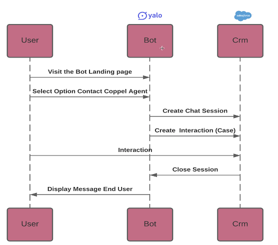
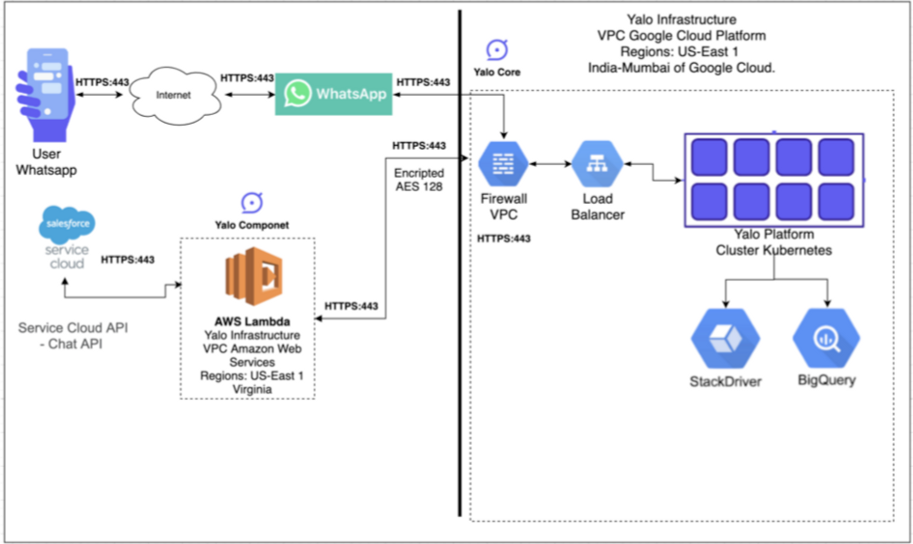
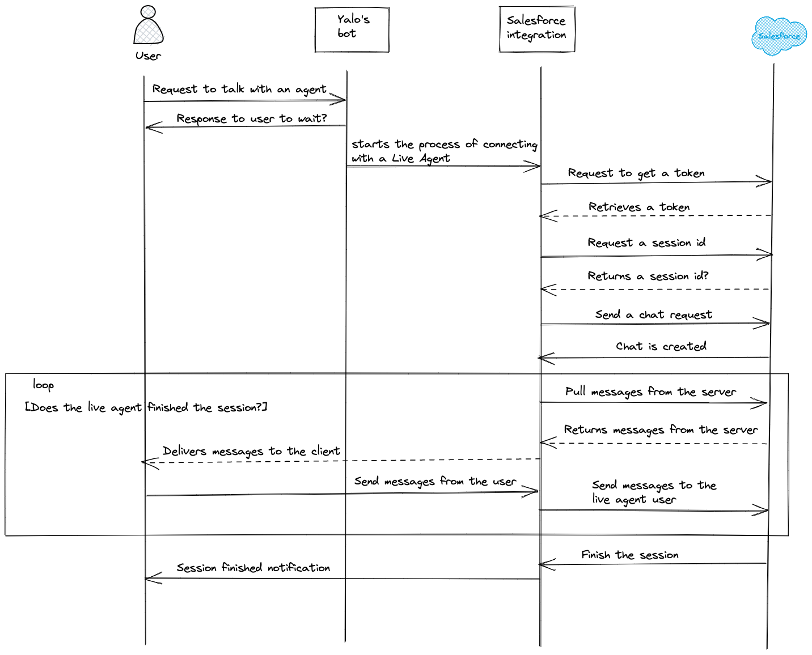
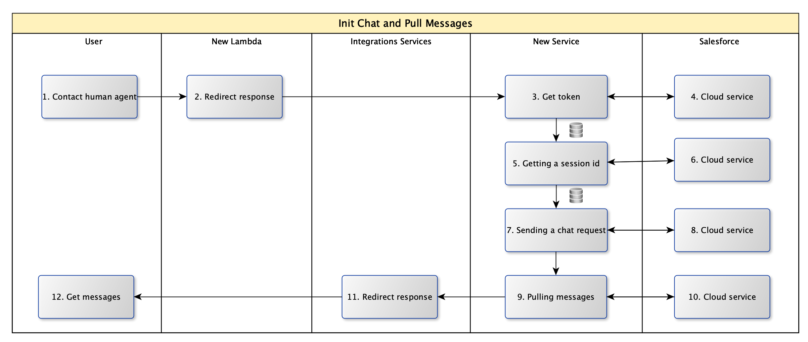
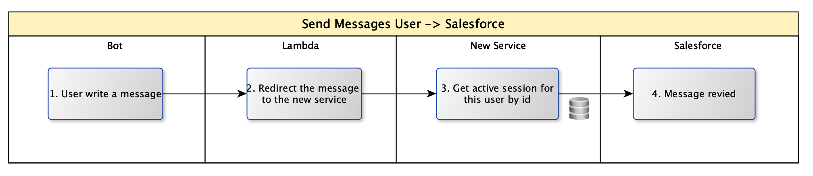

# RFC 155 - Salesforce integration #

## Why?

Is a common requirement that the clients want to implement their own help-desk platforms instead of frontapp.

## Problem statement

At this point we don’t have this module on integrations services. We need to design and develop a solid module to implement it on any client in a easy way

## Alternatives

1.- Develop a micro-service as a middleware between integrations services, salesforce and the end user.

2.- Add a module to integrations services.

## **Proposal**

**Use case**



**architecture diagram**



**Sequence Diagram**


Sales-force have a chat REST API to interact with their platform allow us to programmatically create Live Agent sessions, send messages to available agents, create new records based on chat information, etc.,all through HTTP messages. This are the steps:

**1. Getting a Token**

We need to get a token for the subsequent requests. You need to send a POST request with the following details

**Endpoint**: [https://login.salesforce.com/services/oauth2/token](https://login.salesforce.com/services/oauth2/token)

**Headers**: 

- Content-Type: application/x-www-form-urlencoded'

**Payload:**

```jsx
grant_type:password
client_id:3MVG98hdjyNB1QTkgGsDMceBCmWn2xSiBenQ7v7p78.VzdasDSo835RlVgdiF_5aW4W7QAgqZvwFbH4LWFHTo
client_secret:BF537CCF496D7030D43D75051CD21102F7AD1E7CADC93942DAF7DEBF2BF530CC
username:everardo@yalotest.com
password:Yalopruebas123
```

You will get a response similar to the following

```
{
    "access_token": "00D3g0000003VOm!ARQAQJzlD0cKgBAzx.ot_qHdZnNhebgM.Ijk7an_LdZzN_JUqHasD1GjpeHow5i0TcHmYjtj4cEEL5rMwE7F7mGR9S5eIsi1",
    "instance_url": "https://na110.salesforce.com",
    "id": "https://login.salesforce.com/id/00D3g0000003VOmEAM/0053g000000usWaAAI",
    "token_type": "Bearer",
    "issued_at": "1626975076132",
    "signature": "2UtMAk/S2Xr0HNe73DYSG3UpUzYDP8khlPPlzVpNmco="
}
```

The "access_token" field we will use it on all the next requests
**2. Getting a Session Id**

To get a session Id, you need to send a GET request with the following details

**Endpoint**: /chat/rest/System/SessionId

**Headers**:

- X-LIVEAGENT-API-VERSION : 34
- X-LIVEAGENT-AFFINITY : null

You will get a response similar to the following

```
{
    "clientPollTimeout": 40,
    "key": "49d50d5a-790f-40ec-98ca-8b813e6f0347!c007a252-0f76-473f-b411-588930e09be0",
    "affinityToken": "2c931fa0",
    "id": "49d50d5a-790f-40ec-98ca-8b813e6f0347"
}
```

**3. Sending a Chat Request**

**Note:**

This step must be done almost immediately after getting the response from the previous step as there's a timeout value for the session. It's recommended that you have two REST Console windows opened so that you can quickly change from one request to another.

Using the information from the above response, we’ll send a chat request. To make sure this works, you should log in as a Live Agent user and make yourself available.

To send a chat request, submit a POST message with the following details

**Endpoint**: /chat/rest/Chasitor/ChasitorInit

**Headers** (replace the values below using the information from the previous response)

- X-LIVEAGENT-API-VERSION : 34
- X-LIVEAGENT-AFFINITY :"affinityToken-from-response“
- X-LIVEAGENT-SESSION-KEY : “key-from-response”
- X-LIVEAGENT-SEQUENCE : 1

**Payload**:

```
{
"organizationId": "{{organizationId}}", 
"deploymentId": "{{deploymentId}}", 
"buttonId": "{{buttonId}}", 
"sessionId": "{{id}}", 
"userAgent": "Lynx/2.8.8", 
"language": "en-US", 
"screenResolution": "1900x1080", 
"visitorName": "Frank Underwood", 
"prechatDetails": [],  "prechatEntities": [], 
"receiveQueueUpdates": true, 
"isPost": true 
}
```

You should receive a 200 OK response and you should see a chat request in the Live Agent widget.

**4. Pulling messages from the server**

The response from the previous step only tells you whether the HTTP request was successful, but not whether the chat was accepted, rejected, whether there was an agent available, etc.To get this information, you need to pull messages from the server. 

To do this, send a GET request with the following details

**Endpoint**: chat/rest/System/Messages

**Headers**:

- X-LIVEAGENT-API-VERSION : 52
- X-LIVEAGENT-AFFINITY :"affinityToken-from-response“
- X-LIVEAGENT-SESSION-KEY : “key-from-response”

The first time you send this request, you should get a response similar to the following, letting you know the chat request was successful and that the live agent user sent a message, among other details..

```
{
    "messages": [
        {
            "type": "ChatEstablished",
            "message": {
                "name": "Everardo G",
                "userId": "0053g000000usWa",
                "items": [],
                "sneakPeekEnabled": false,
                "chasitorIdleTimeout": {
                    "isEnabled": false
                }
            }
        },
        {
            "type": "ChatMessage",
            "message": {
                "text": "ok",
                "name": "Everardo G",
                "schedule": {
                    "responseDelayMilliseconds": 0.0
                },
                "agentId": "0053g000000usWa"
            }
        }
    ],
    "sequence": 3,
    "offset": 1574190116
}
```

In the response above, the "text" attribute shows a message sent from the live agent user to the visitor.

**5. Sending messages to the live agent user**

To send messages to the live agent user, simply submit a POST request with the following details

**Endpoint**: /chat/rest/Chasitor/ChatMessage

**Headers:**

- X-LIVEAGENT-API-VERSION : 52
- X-LIVEAGENT-AFFINITY :"affinityToken-from-response“
- X-LIVEAGENT-SESSION-KEY : “key-from-response”

**Payload:**

```
{"text" : "Hi, I need help with my TV settings."}
```

If the request is successful you will see the message in the live agent chat window.

### Where the api keys will storage

On secrets manager on gcp

```

{botSlug}-client_id: 3MVG98hdjyNB1QTkgGsDMceBCmWn2xSiBenQ7v7p78.VzdasDSo835RlVgdiF_5aW4W7QAgqZvwFbH4LWFHTo
{botSlug}-client_secret: BF537CCF496D7030D43D75051CD21102F7AD1E7CADC93942DAF7DEBF2BF530CC
{botSlug}-username: everardo@yalotest.com
{botSlug}-password: Yalopruebas123
{botSlug}-organizationId: 00D3g0000003VOm, 
{botSlug}-deploymentId: 5723g000000k9wz,
{botSlug}-buttonId: 5733g000000KzA3
```

### Where the session will storage

The data relevant to a session will storage on redis

```json
{
		"idUser": "phoneId or messengerId",
    "clientPollTimeout": 40,
    "key": "49d50d5a-790f-40ec-98ca-8b813e6f0347!c007a252-0f76-473f-b411-588930e09be0",
    "affinityToken": "2c931fa0",
    "id": "49d50d5a-790f-40ec-98ca-8b813e6f0347",
		"status": "active|close",
		"timestamp": "1628184640"
}
```

### New Lambda

- Trigger a call to “New Service” when a user requires human assistance.
- Also, send all the messages that a user writes to sales force.

### New Service

- Initialize a new chat with Salesforce API, getting a sessionId and chatId, this params must be save it on a mongodb instance for consuming forward.
- Then the service will start to polling messages from salesforce and deliver them to an end user across “Integrations Service”. The polling process have to trigger every “X” seconds a call for get all the messages from salesforce until the connection is close by a user or a human agent.





### **Dependencies**

Production and develop endpoints from salesforce.

Salesforce permissions, configurations and authentication credencials